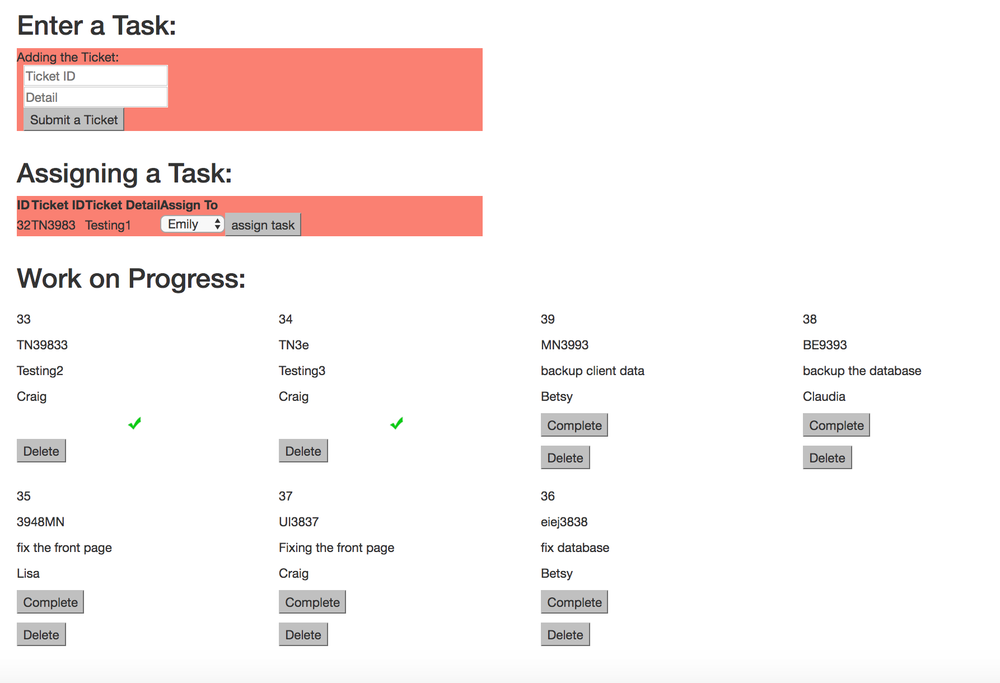

**System Detail**

As a project manager, Emily Hoang, will assign task among her team:

**Client Side**
* Emily needs to add the ticket Detail
* Show the list of the tickets and drop down box of showing the employee to assign to
* List of unassign and list of assign
* Once list of unassign choose who works on , it moves to assign list
* Assign list should have the complete and delete task
* Whether or not a task is complete should also be stored in the database.
* Deleting a task should remove it both from the Front End as well as the Database

**Database**
When the task is created, it should be stored inside of a database (SQL)
-taskinfo table: generate ticket-id, ticket-detail
-employee: list of employees
-tasking: reference of the employee_id (employee table) and task_id (taskinfo table)

## HARD MODE ##
* In whatever fashion you would like, create an 'are you sure: yes / no' option when deleting a task. Once again, you can interrupt this however you would like.

## PRO MODE ##
* Adjust the logic so that completed tasks are brought to the bottom of the page, where the remaining tasks left to complete are brought to the top of the list.

## Technical Used ##
AJax, Jquery, SQL, Express, Node.js, CSS3, HTML 5

